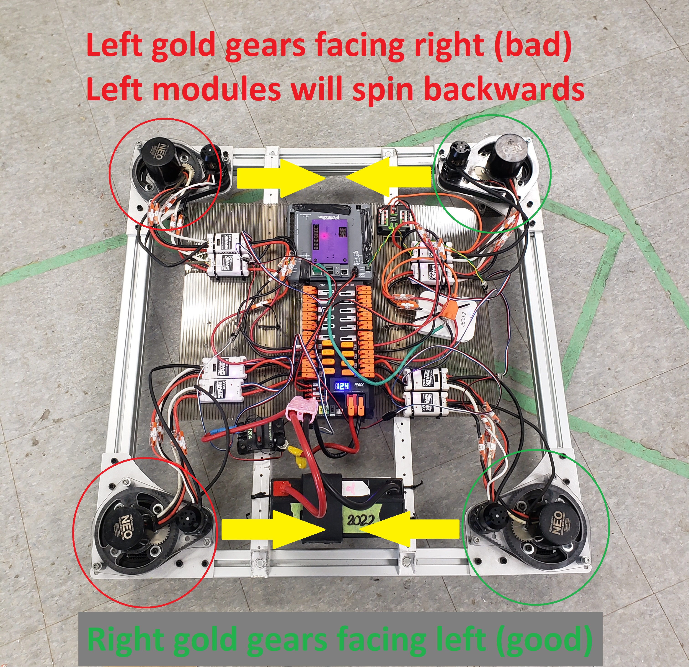

# How to use the robot

## Pre-match setup
* **Don't** turn on the robot yet
* Place the robot in the correct position
* Align the swerve modules (see Swerve module alignment)
* Now you can turn the robot on

## Swerve module alignment
**THESE ALIGNMENT INSTRUCTIONS ARE FOR THE SWERVE PRACTICE BOT.**

**FOR THE COMPETITION ROBOT, ALIGN THE NOTCH ON EACH MODULE WITH THE NOTCH ON THE ALUMINUM PLATE.**

Before turning on the robot, you must line up all four swerve modules so that the black gear on each wheel faces to the left of the robot:

Alternatively, align the wheels so that the gold on the top of each module faces to the left of the robot:

The battery is located at the rear of the robot. Front is the direction facing away from the battery.

Misaligned wheels will make it impossible to drive the robot properly:

You have to look at the gears to verify the wheels are aligned correctly. The wheels are all straight, however, the two left modules will spin backwards:

(Notice the gold gears on the left two modules are facing towards the right.)

To line up the wheels, lift up the corner of the robot and turn the wheel by hand. Once the module faces the correct direction, spin the small NEO on the module to make fine adjustments.

If the robot is already turned on, disable it and line up the wheels, then press "Reset Encoders" in Shuffleboard or reset the robot code (either through the driver station or by pressing the "Reset" button on the roboRIO).

## Using the robot
### Field Relative (Field Oriented) Drive
When the robot is driven with field-relative (or field oriented) drive turned off, horizontal and vertical movement is relative to the robot. For example, if the robot is facing to the right of the field, pushing the joystick forward will move the robot towards the right (where it is facing).

With field oriented drive turned on, horizontal and vertical movement is relative to the **field**. If the robot is facing in the same direction as before (the right), then telling it to move forward will move it away from you, while continuing to point to the right.

Rotation remains the same whether field oriented is on or off.

Note that field oriented drive does not need an actual field to function. When the robot is turned on, the robot assumes that it is in one of the left corners of the field, facing towards the field's centre.

If you drive the robot with no field, line the robot up in front of the driver station, and make sure the robot faces forward (away from the driver station). This will make it more intuitive to drive (moving left, right, forward, or back will move the robot in that direction relative to the driver station) during a demonstration or while testing the robot.

### Gyro Drift
The NavX IMU's built in gyroscope is used to keep track of the direction the robot is facing while in field-oriented mode. Like all gyros, the NavX's gyro drifts, although in a regular match it will not drift enough to be noticeable.

If you are using the robot for a demonstration, you may have it on long enough for it to be affected by gyro drift. To calibrate the gyro, align the robot so it faces forward and then press `Zero Yaw` on Smartdashboard or push the `A button` on the driver's Xbox controller.

### Field Position Inaccuracy
To determine its position relative to the field, the robot relies on the total amount of rotations made by the drive motor of each swerve module. **If you picked up the robot and moved it to a different location, it *will not* know that its position changed!**

While the robot is being driven, wheels can slip and the robot can bump against objects on the field, or be pushed around by other robots. This can cause the reported position to differ from the actual position of the robot.

Since making contact with other robots during autonomous mode is prohibited (and you are hopefully not colliding with game objects or the field), the reported position of the robot will be accurate. **You can safely use the robot position in autonomous mode.**

-> Hello and welcome to 2023 Charged Up, where there is an unpredictable balancing platform right in the middle of the field...
-> Add a note regarding this

However, in teleop mode, the robot can collide with parts of the field, and other robots, which will cause the reported position to differ from the actual position. **In teleop mode, you should *not* rely on the robot's reported position to be accurate!** This also means that the robot position in the Field2d widget in Shuffleboard may not correspond to its actual position.

## Controls
### Driver:
| Control               | Function                    |
| --------------------- | --------------------------- |
| Left Joystick X Axis  | Move robot left and right   |
| Left Joystick Y Axis  | Move robot forward and back |
| Right Joystick X Axis | Rotate robot left and right |
| Y Button              | Reset gyro yaw angle        |

### Operator:
| Control               | Function               |
| --------------------- | -----------------------|
| Left Joystick Y Axis  | Manual: Move lower arm |
| Right Joystick Y Axis | Manual: Move upper arm |
| Left Bumper           | Open Gripper           |
| Right Bumper          | Close Gripper          |
| X Button              | Move to stow position  |
| A Button              | Move to low node       |
| B Button              | Move to mid node       |
| Y Button              | Move to high node      |
| Start Button          | Toggle Manual Control  |

## Dashboard
This repository comes with a premade Shuffleboard layout. To use it, open Shuffleboard, open the File menu and press Load layout, then select `robot-shuffleboard-layout.json` in the root of this repository.

### Drivetrain Tab
Swerve Drive related data and buttons are available in the `Drivetrain` tab in Shuffleboard.

This tab contains information on each module's angle, velocity, and distance driven, as well as the robot's heading and field position.

The Field in the centre of the tab shows the robot's position in the field. Below it is the robot's heading, and buttons for setting up the drivetrain.
- `Zero Yaw` resets the robot's heading.
- `Reset Encoders` resets the reported position of the drive and rotation encoders. Line up the wheels and then press this button to reset their reported position.
- `Is Field Relative` toggles field-relative (field-oriented) drive. You can turn this on or off at any time (the robot will remember where it is even if this is turned off).